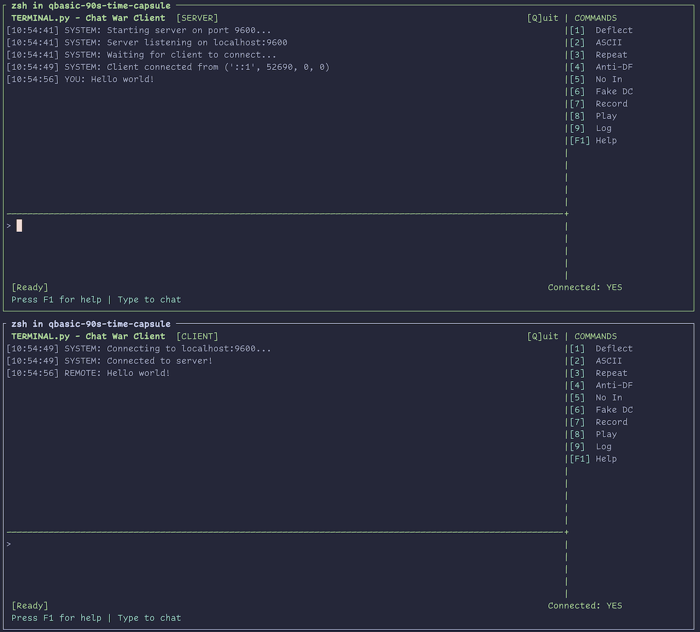

# QBasic Programs (1994-1997)

A collection of QBasic programs I wrote in middle school and high school, preserved from the mid-1990s. These programs represent my early programming journey, learning to code on DOS machines with QuickBASIC 4.5.

## Highlighted Programs

### TERMINAL.BAS - Serial Chat Client

**Location:** `my-programs/chat-terminal/`

A feature-rich serial port terminal program for PC-to-PC chat over null modem cables. This was part of a friendly "chat war" with a friend - we'd implement pranks and counter-measures against each other.

**Features:**

- Dual COM port support (COM1 for direct connection, COM2 for modem)
- Split-screen UI with status bar
- **Deflector** - Bounce incoming messages back at the sender
- **Anti-Deflector** - Filter out reflected messages
- **ASCII Spam** - Flood random characters
- **Repeat Send** - Message bombing
- **Fake Disconnect** - Pretend to leave, then surprise them
- Session logging to file
- Message recording and playback

_The TERMINA2, TERMINA3, and TERMINA4 files show the evolution as new features were added._

---

### Screensaver Series

**Location:** `my-programs/screensavers/`

A progression of bouncing line/shape animations, each iteration adding new features:

| Program          | Description                                             |
| ---------------- | ------------------------------------------------------- |
| **BOUNCE.BAS**   | Simple bouncing circle                                  |
| **BOUNCE2.BAS**  | Added color cycling                                     |
| **BOUNCE3.BAS**  | Two objects with collision detection                    |
| **LINES.BAS**    | Radial lines creating interference patterns             |
| **SCREEN.BAS**   | 20-point bouncing polygon                               |
| **SHBONCE2.BAS** | Mesh-connected bouncing points                          |
| **SQUBONC3.BAS** | User-configurable: choose number of shapes and vertices |

_These demonstrate learning graphics programming through iteration - each version building on the last._

---

### Math Homework Helpers

**Location:** `my-programs/math-helpers/`

Programs I wrote to help with (or automate) algebra homework:

| Program          | Description                                          |
| ---------------- | ---------------------------------------------------- |
| **MATH2.BAS**    | Factors quadratic trinomials (x² + bx + c)           |
| **MATH3.BAS**    | Handles leading coefficients (ax² + bx + c)          |
| **CHAPTER4.BAS** | Solves systems of linear equations using elimination |
| **SENSUB.BAS**   | Synthetic division calculator - shows all work       |
| **ABLRA\*.BAS**  | Various algebra problem solvers                      |

_Complete with typos like "Eneter" and "pionts" - authentic middle school code!_

---

### Prank Programs

**Location:** `my-programs/pranks/`

| Program          | Description                                                                                             |
| ---------------- | ------------------------------------------------------------------------------------------------------- |
| **FAKEDOS.BAS**  | Fake DOS prompt that pretends to delete files, requires a Fibonacci sequence to escape (11235813213455) |
| **FORMAT_C.BAS** | Fake format C: command                                                                                  |

---

## Directory Structure

```
QBasic/
├── my-programs/           # Programs I wrote
│   ├── screensavers/      # Bouncing lines and shapes
│   ├── math-helpers/      # Algebra homework automation
│   ├── chat-terminal/     # Serial chat client (TERMINAL.BAS)
│   ├── graphics-demos/    # Graphics experiments
│   ├── pranks/            # FAKEDOS, FORMAT_C
│   └── misc/              # Other personal projects
│
├── samples/               # Code I didn't write
│   ├── microsoft/         # QB4.5 sample programs (TORUS, MANDEL, etc.)
│   └── third-party/       # Friend's code & downloaded programs
│
├── 90s-shareware/         # BBS/shareware collection from the era
│
├── qbasic-runtime/        # QB.EXE and supporting files
│
├── build-artifacts/       # Compiled .EXE, .OBJ, and data files
│
└── tools/                 # Modern helper scripts
    ├── qb.sh              # Launch programs in DOSBox
    └── convert_binary.sh  # Convert tokenized files to text
```

## Running These Programs

### Using DOSBox

The `tools/qb.sh` script launches programs in DOSBox:

```bash
# Open QuickBASIC IDE
./tools/qb.sh

# Open a program in the editor
./tools/qb.sh my-programs/screensavers/LINES.BAS

# Run a program directly
./tools/qb.sh my-programs/screensavers/LINES.BAS run
```

### Requirements

- [DOSBox](https://www.dosbox.com/) or [DOSBox-X](https://dosbox-x.com/)
- The QuickBASIC 4.5 runtime (included in `qbasic-runtime/`)

## Historical Context

These programs were written between 1994-1997 when I was in 8th-9th grade. They represent:

- **Learning through iteration** - Multiple versions of programs as I learned new techniques
- **Practical problem-solving** - Math helpers to automate tedious homework calculations
- **Creative exploration** - Screensavers pushing the limits of VGA graphics
- **Social coding** - The TERMINAL chat programs were part of a friendly rivalry, trading pranks and counter-measures with a friend over null modem cables

The code style reflects its era: line numbers (in some files), GOTO statements, global variables, and creative variable naming. It's preserved here as a time capsule of 1990s hobbyist programming.

## Python Conversions

Select programs have been converted to modern Python, preserving the original functionality while adding proper variable names and documentation. Easter egg typos from the originals are preserved as comments.

### Screensavers (pygame)

| Python File   | Original     | Description                                              |
| ------------- | ------------ | -------------------------------------------------------- |
| `LINES.py`    | LINES.BAS    | Radial lines from center with wave pattern               |
| `BOUNCE.py`   | BOUNCE.BAS   | Bouncing circle with line to center (SPACE toggles size) |
| `SQUBONC3.py` | SQUBONC3.BAS | Configurable bouncing polygons                           |
| `SCREEN.py`   | SCREEN.BAS   | 20-point polygon with RGB color cycling                  |

### Running the Python Screensavers

```bash
# Set up virtual environment (one-time)
python3 -m venv venv
source venv/bin/activate
pip install pygame

# Run any screensaver
python LINES.py
python BOUNCE.py
python SQUBONC3.py
python SCREEN.py

# Deactivate when done
deactivate
```

**Controls:**

- **ESC** or close window to quit
- **SPACE** (BOUNCE.py only) - Toggle radius growth on/off

**Note:** On macOS, the pygame window may open behind other windows. Check your Dock or use Cmd+Tab to find it.

### Chat Terminal (curses TUI)

| Python File   | Original     | Location                     | Description                                |
| ------------- | ------------ | ---------------------------- | ------------------------------------------ |
| `TERMINAL.py` | TERMINAL.BAS | `my-programs/chat-terminal/` | Two-terminal chat with "chat war" features |

A modern recreation of the 1475-line TERMINAL.BAS - a full-duplex chat client originally designed for serial port communication, now using TCP sockets.



```bash
# Start server in one terminal
python3 my-programs/chat-terminal/TERMINAL.py --server

# Connect client in another terminal
python3 my-programs/chat-terminal/TERMINAL.py --client

# Connect to a specific host
python3 my-programs/chat-terminal/TERMINAL.py --client --host 192.168.1.5
```

**Chat War Features:**
| Key | Feature | Description |
|-----|---------|-------------|
| 1 | Deflector | Bounce incoming messages back at sender |
| 2 | ASCII Spam | Flood random ASCII characters |
| 3 | Repeat Send | Continuously resend a message |
| 4 | Anti-Deflector | Filter your own reflected messages |
| 5 | No Input | Ignore all incoming messages |
| 6 | Fake Disconnect | Pretend to leave, wait for keypress |
| 7 | Record | Start/stop recording incoming messages |
| 8 | Playback | Send the recorded message |
| 9 | File Log | Log session to file |
| Q | Quit | Exit the program |
| F1 | Help | Toggle help overlay |

Port 9600 is used by default (matching the original baud rate for nostalgia).

### Math Helpers (no dependencies)

| Python File   | Original     | Description                                               |
| ------------- | ------------ | --------------------------------------------------------- |
| `MATH2.py`    | MATH2.BAS    | Factor quadratics (x² + bx + c)                           |
| `MATH3.py`    | MATH3.BAS    | Factor quadratics with leading coefficient (ax² + bx + c) |
| `CHAPTER4.py` | CHAPTER4.BAS | Solve 2-variable linear systems                           |
| `SENSUB.py`   | SENSUB.BAS   | Synthetic division calculator                             |
| `BASES.py`    | BASES.BAS    | Number base conversion                                    |

```bash
# Run directly (no setup needed)
python3 my-programs/math-helpers/MATH2.py
python3 my-programs/math-helpers/SENSUB.py
# etc.
```

### Other Terminal Programs (no dependencies)

| Python File  | Original    | Location              | Description                     |
| ------------ | ----------- | --------------------- | ------------------------------- |
| `FAKEDOS.py` | FAKEDOS.BAS | `my-programs/pranks/` | Fake DOS prompt prank           |
| `ASCII.py`   | ASCII.BAS   | `my-programs/misc/`   | Random colored ASCII characters |

```bash
# Run directly (no setup needed)
python3 my-programs/pranks/FAKEDOS.py
python3 my-programs/misc/ASCII.py
```

**FAKEDOS.py** simulates a DOS prompt that:

- Pretends to delete files with `DEL`
- Shows "Squids Rule" in random colors on `CLS`
- Reports "MS-DOS Version 1.00" on `VER`
- Requires the Fibonacci password `11235813213455` to `EXIT`

**ASCII.py** prints random ASCII characters in random colors. Press **ESC** to quit.

---

## File Format Note

QBasic saved files in two formats:

- **Text** - Human-readable source code
- **Binary tokenized** - Compressed format starting with `0xFC` byte

Most files have been converted to text format for readability. The `tools/convert_binary.sh` script can convert any remaining binary files using DOSBox.
